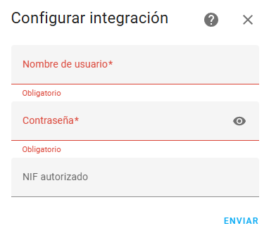

[](https://github.com/custom-components/hacs)

[](https://github.com/uvejota/homeassistant-edata/releases/latest)

# homeassistant-edata


Esta integración para Home Assistant te permite seguir de un vistazo tu consumo, generación y máximas potencias registradas (maxímetro) configurando tu usuario de Datadis.

Para la visualización de los datos, existen varias alternativas:
1. Configurar el Panel de Energía nativo de Home Assistant.
2. Utilizar la tarjeta nativa de esta integración (edata-card). **RECOMENDADO, CONFIGURACIÓN SENCILLA.**
3. Utilizar tarjetas de terceros (e.g., apexcharts-card) que consume los datos de la integración por Websockets. **Para los más cafeteros...**


## Índice de contenidos

1. [Ejemplo de Dashboard](#Ejemplo-de-Dashboard)<br>
2. [Limitaciones](#Limitaciones)<br>
3. [Instalación](#Instalación)<br>
4. [Sensores de la integración](#Sensores-de-la-integración)<br>
5. [Integración con panel Energía (Long Term Statistics)](#Integración-con-panel-Energía-Long-Term-Statistics)<br>
6. [Configurar la tarificación](#Configurar-la-tarificación)<br>
7. [Gráficas con tarjeta nativa](#Gráficas-con-tarjeta-nativa)<br>
8. [Gráficas sobre ApexCharts-card](#Gráficas-sobre-apexcharts-card)<br>
9. [Acceso a datos descargados](#Acceso-a-datos-descargados)<br>
10. [FAQ](#FAQ)

## Ejemplo de Dashboard


## Limitaciones

* Los datos mostrados **jamás serán en tiempo real**, ya que se saca de la información que registra/factura tu distribuidora y expone a través de la plataforma Datadis. *Siendo optimistas* obtendrás tus datos con al menos dos días de retraso.
* Las opciones de tarificación para **estimar** la factura, quedan limitadas a tarifas 2.0TD PVPC, o precio fijo con distinción de tres tramos: punta, llano y valle. La tarificación del retorno NO está disponible aún.
* Se depende de la disponibilidad de Datadis, si la API no devuelve datos, no hay NADA que hacer. **Lo que se ve en la Web de Datadis no tiene por qué coincidir con los datos que devuelve la API, son fuentes distintas**

## Instalación

Para instalar esta integración en Home Assistant necesitarás:

* una cuenta funcional (y validada) en la web de [Datadis](https://www.datadis.es)
  * no hay que marcar la casilla de la API al registrar, usaremos la privada que está habilitada por defecto,
* una instalación *reciente* y funcional de Home Assistant (a partir de ahora HA), los componentes `recorder` y `lovelace` deben estar disponibles (lo están por defecto),
* instalar [HACS](https://hacs.xyz/),
* (opcional) instalar el componente [apexchart-card](https://github.com/RomRider/apexcharts-card) (usando HACS) si se quisiera utilizar este método para visualizar los datos.

Una vez satisfecho lo anterior, los pasos a seguir para la instalación son:

1. Añadir este repositorio (<https://github.com/uvejota/homeassistant-edata>) a los repositorios personalizados de HACS,
2. Instalar la integración mediante HACS, y
3. Buscar "edata" en `Configuración > Dispositivos y servicios > Añadir integración`


4. Configurar sus credenciales de Datadis, indicando el NIF autorizado _únicamente si no es el titular del suministro indicado_. A continuación se listará los suministros encontrados para las credenciales introducidas.



5. Esperar unos minutos. Le aparecerá un nuevo dispositivo, que consta de un sensor principal llamado `sensor.edata_xxxx` donde `xxxx` dependerá de los últimos caracteres de su CUPS, y de otros sensores con los datos.

> **NOTA:** La instalación puede tardar bastante en su primera ejecución, ya que la integración "rescata" el último año de consumos desde Datadis, y ésta a veces puede tomarse su tiempo. Periódicamente, la integración solicitará únicamente lo que le falta, en intervalos de 24h.

## Sensores de la integración

La integración ofrece los sensores de la figura. Cada sensor dispone de una serie de atributos visibles al pinchar, por ejemplo indicando qué parte del consumo se ha registrado en P1, P2, y P3.


## Integración con panel Energía (Long Term Statistics)

La integración combina almacenamiento local (en ficheros), con la base de datos de estadísticas nativa de Home Assistant, lo cual habilita su uso en el panel de energía. Por defecto, las estadísticas generadas serán:

| statistic_id | Tipo | Unidad | Significado |
| ------------- | ------------- | ------------- | ------------- |
| `edata:xxxx_consumption` | `sum` | `kWh` | Consumo total |
| `edata:xxxx_p1_consumption` | `sum` | `kWh` | Consumo en P1 |
| `edata:xxxx_p2_consumption` | `sum` | `kWh` | Consumo en P2 |
| `edata:xxxx_p3_consumption` | `sum` | `kWh` | Consumo en P3 |
| `edata:xxxx_surplus` | `sum` | `kWh` | Generación total  |
| `edata:xxxx_maximeter` | `max` | `kW` | Maxímetro |
| `edata:xxxx_p1_maximeter` | `max` | `kW` | Maxímetro en P1 |
| `edata:xxxx_p2_maximeter` | `max` | `kW` | Maxímetro en P2 |
| `edata:xxxx_cost`*  | `float` | `€` | Coste total |
| `edata:xxxx_p1_cost`*  | `float` | `€` | Coste total en P1 |
| `edata:xxxx_p2_cost`*  | `float` | `€` | Coste total en P2 |
| `edata:xxxx_p3_cost`*  | `float` | `€` | Coste total en P3 |
| `edata:xxxx_power_cost`*  | `float` | `€` | Coste (potencia) |
| `edata:xxxx_energy_cost`*  | `float` | `€` | Coste (energía) |
| `edata:xxxx_p1_energy_cost`*  | `float` | `€` | Coste (energía) en P1 |
| `edata:xxxx_p2_energy_cost`*  | `float` | `€` | Coste (energía) en P2 |
| `edata:xxxx_p3_energy_cost`*  | `float` | `€` | Coste (energía) en P3 |

\* Los campos marcados con asterisco no están habilitados por defecto, y se habilitan como indica el siguiente apartado.

## Configurar la tarificación

Navegue hasta `Ajustes > Dispositivos y Servicios > XXXX (edata) - Configurar`. Primero deberá seleccionar si desea activar o no las funciones de facturación, y en caso de utilizar PVPC seleccionará también dicha casilla.

1. Activar la facturación y/o PVPC.


2. Si no ha activado PVPC, tendrá que configurar los costes asociados a cada término (según su contrato).


3. Personalización de fórmulas con expresiones jinja2. Tendrá que adaptar la fórmula según su tipología de contrato.

Las variables disponibles son las configuradas en el paso anterior y los consumos del periodo a tarificar, pero con los siguientes nombres:
* `electricity_tax`: impuesto a la electricidad (e.g. 1.05 para el 5%)
* `iva_tax`: IVA (e.g., 1.21 para 21%)
* `kwh_eur`: coste del kWh en euros para la hora del consumo (se escoge automáticamente entre p1, p2, y p3; según convenga)
* `kwh`: energía consumida en kWh
* `p1_kw` y `p2_kw`: potencia contratada en P1 y P2 (en kW)
* `p1_kw_year_eur` y `p2_kw_year_eur`: Coste de la potencia por kW en P1 y P2 (en euros y anual)
* `meter_month_eur`: Coste del alquiler del contador en euros al mes

Las variables anteriores pueden usarse para formar expresiones para los siguientes términos: energía, potencia y otros. No olvides contemplar el IVA. Puedes utilizar la que viene por defecto como base.

> **NOTA 1:** ¡Siempre en minúscula!
>
> **NOTA 2:** ¡No elimines las llaves del principio y final!
>
> **NOTA 3:** El retorno o batería virtual aún no está soportado.


4. Simulación del último mes y selección de la fecha de inicio para aplicar nueva tarificación.

Este último paso es para confirmar que hemos confeccionado nuestras fórmulas correctamente. Es un simulador del último mes completo (si estás a mediados de julio, calculará junio), de modo que si se acerca a la de tu factura... ¡Lo has hecho bien!

No hay que rellenar nada, sólo visualizar, marcar la fecha desde la cual quieres aplicar los cambios de tarificación, y confirmar.


Una vez configuradas y calculadas (tendrá que esperar un poco), las estadísticas pueden configurarse en el panel de energía en `Ajustes > Paneles de control > Energía > Añadir consumo (Red Eléctrica)`:


> **NOTA:** Esta integración hace un uso _gracioso_ del panel de estadísticas de Home Assistant que, aunque lo permite, no está totalmente preparado para manipular estadísticas a pasado.

## Gráficas con tarjeta nativa

Se ofrecen una serie de tarjetas nativas que facilitan la representación de los datos y pueden configurarse desde la UI de Home Assistant, seleccionando la configuración que desee en el editor.


Las tarjetas disponibles son:
- Gráfica de consumos (`consumptions`), excedente (`surplus`), o facturas (`costs`); agrupados por hora/mes/día/año.
- Gráfica de potencias máximas registradas (`maximeter`)
- Resumen del último día registrado (`summary-last-day`), mes en curso (`summary-month`), o mes pasado (`summary-last-month`).

Adicionalmente, puedes cambiar los colores añadiendo el atributo `colors` al YAML resultante:

```yaml
type: custom:edata-card
...
colors: # opcional, para cambiar los colores
  - '#e54304'
  - '#ff9e22'
  - '#9ccc65'
```

> **NOTA:** en futuras versiones se contempla ampliar y mejorar las funcionalidades de la tarjeta, así como proporcionar traducciones.


## Gráficas sobre ApexCharts-card

A continuación se ofrece la configuración orientativa para **visualizar los datos obtenidos mediante apexcharts-card**, que también debe instalarse manualmente o mediante HACS. Siga las instrucciones de <https://github.com/RomRider/apexcharts-card> y recuerde tener el repositorio a mano para personalizar las gráficas a continuación.

> **IMPORTANTE:** en las siguientes tarjetas deberá reemplazar TODAS las ocurrencias de `xxxx` por sus últimos cuatro caracteres de su CUPS.
>
> **El nombre de las entidades puede ser distinto en su instalación. Revíselo.**

Además, puedes consultar la sección _Discussions_ del repositorio, en el que los usuarios pueden compartir sus configuraciones, por si te gusta alguna.

### Consumo diario


<details>
<summary>He leído las instrucciones y quiero ver el contenido</summary>

``` yaml
type: custom:apexcharts-card
graph_span: 30d
stacked: true
span:
  offset: '-1d'
experimental:
  brush: true
header:
  show: true
  title: Consumo diario
  show_states: false
  colorize_states: false
brush:
  selection_span: 10d
all_series_config:
  type: column
  unit: kWh
  show:
    legend_value: false
series:
  - entity: sensor.edata_xxxx
    name: Total
    type: column
    data_generator: |
      return hass.connection.sendMessagePromise({
      type: 'edata/consumptions/daily',
      scups: 'xxxx'}).then(
          (resp) => {
              return resp.map((data, index) => {
                return [new Date(data['datetime']).getTime(), data['value_kWh']];
              });
          }
      );
    show:
      in_chart: false
      in_brush: true
  - entity: sensor.edata_xxxx
    name: Punta
    stack_group: "1"
    data_generator: |
      return hass.connection.sendMessagePromise({
      type: 'edata/consumptions/daily',
      scups: 'xxxx'}).then(
          (resp) => {
              return resp.map((data, index) => {
                return [new Date(data['datetime']).getTime(), data['value_p1_kWh']];
              });
          }
      );
  - entity: sensor.edata_xxxx
    name: Llano
    stack_group: "1"
    data_generator: |
      return hass.connection.sendMessagePromise({
      type: 'edata/consumptions/daily',
      scups: 'xxxx'}).then(
          (resp) => {
              return resp.map((data, index) => {
                return [new Date(data['datetime']).getTime(), data['value_p2_kWh']];
              });
          }
      );
  - entity: sensor.edata_xxxx
    name: Valle
    stack_group: "1"
    data_generator: |
      return hass.connection.sendMessagePromise({
      type: 'edata/consumptions/daily',
      scups: 'xxxx'}).then(
          (resp) => {
              return resp.map((data, index) => {
                return [new Date(data['datetime']).getTime(), data['value_p3_kWh']];
              });
          }
      );
```

</details>

### Consumo mensual


<details>
<summary>He leído las instrucciones y quiero ver el contenido</summary>

``` yaml
type: custom:apexcharts-card
graph_span: 395d
stacked: true
yaxis:
  - id: eje
    opposite: false
    max: '|+20|'
    min: ~0
    apex_config:
      forceNiceScale: true
header:
  show: true
  title: Consumo mensual
  show_states: false
  colorize_states: false
all_series_config:
  type: column
  yaxis_id: eje
  unit: kWh
  extend_to: false
  show:
    legend_value: false
series:
  - entity: sensor.edata_xxxx
    type: line
    name: Total
    data_generator: |
      return hass.connection.sendMessagePromise({
      type: 'edata/ws/consumptions',
      scups: 'xxxx',
      aggr: 'month',
      records: 12});
    show:
      in_chart: true
  - entity: sensor.edata_xxxx
    name: Punta
    stack_group: "1"
    data_generator: |
      return hass.connection.sendMessagePromise({
      type: 'edata/ws/consumptions',
      scups: 'xxxx',
      aggr: 'month',
      tariff: 'p1',
      records: 12});
  - entity: sensor.edata_xxxx
    name: Llano
    stack_group: "1"
    data_generator: |
      return hass.connection.sendMessagePromise({
      type: 'edata/ws/consumptions',
      scups: 'xxxx',
      aggr: 'month',
      tariff: 'p2',
      records: 12});
  - entity: sensor.edata_xxxx
    name: Valle
    stack_group: "1"
    data_generator: |
      return hass.connection.sendMessagePromise({
      type: 'edata/ws/consumptions',
      scups: 'xxxx',
      aggr: 'month',
      tariff: 'p3',
      records: 12});
```

</details>

### Maxímetro


<details>
<summary>He leído las instrucciones y quiero ver el contenido</summary>

``` yaml
type: custom:apexcharts-card
graph_span: 1y
span:
  offset: '-15d'
header:
  show: true
  title: Maxímetro
  show_states: false
  colorize_states: false
chart_type: scatter
series:
  - entity: sensor.edata_xxxx
    type: column
    extend_to: false
    name: Punta
    show:
      extremas: true
      datalabels: false
    data_generator: |
      return hass.connection.sendMessagePromise({
      type: 'edata/ws/maximeter',
      tariff: 'p1',
      scups: 'xxxx'});
  - entity: sensor.edata_xxxx
    type: column
    extend_to: false
    name: Llano y Valle
    show:
      extremas: true
      datalabels: false
    data_generator: |
      return hass.connection.sendMessagePromise({
      type: 'edata/ws/maximeter',
      tariff: 'p2',
      scups: 'xxxx'});
```

</details>

### Detalle de un día/mes concreto


<details>
<summary>He leído las instrucciones y quiero ver el contenido</summary>

``` yaml
type: custom:apexcharts-card
chart_type: pie
header:
  show: true
  title: Mes en curso
  show_states: true
  colorize_states: true
  floating: true
all_series_config:
  show:
    legend_value: true
    in_header: false
  unit: kWh
apex_config:
  chart:
    height: 250px
series:
  - entity: sensor.xxxx_consumo_en_el_mes
    show:
      in_chart: false
      in_header: true
    name: Total
  - entity: sensor.xxxx_consumo_en_el_mes
    attribute: month_p1_kWh
    name: Punta
  - entity: sensor.xxxx_consumo_en_el_mes
    attribute: month_p2_kWh
    name: Llano
  - entity: sensor.xxxx_consumo_en_el_mes
    attribute: month_p3_kWh
    name: Valle
  - entity: sensor.xxxx_factura_del_mes
    name: Facturación
    show:
      in_chart: false
      in_header: true
    unit: €
```

</details>

## Acceso a datos descargados

Los datos descargados se almacenan en:
1. Base de datos de estadísticas de HA (Long Term Statistics)
2. Ficheros json ubicado en `config/.storage/edata/edata_xxxx.json`

Para acceder a los mismos, puede consumir la propia API de websockets que utilizan las tarjetas, bajo las definiciones a continuación

| **Nombre del WebSocket** | **Descripción**                       | **Endpoint**                           | **Parámetros**                                                                                                                  |
|--------------------------|---------------------------------------|------------------------------------|---------------------------------------------------------------------------------------------------------------------------------|
| `ws_get_consumptions`    | Obtiene el historial de consumos.     | `/ws/consumptions`   | `scups` (requerido): Identificador SCUPS (CUPS abreviado). <br> `aggr` (opcional, por defecto: "day"): Nivel de agregación ("day", "hour", "week", "month"). <br> `records` (opcional, por defecto: 30): Número de registros a obtener. <br> `tariff` (opcional): Tramo ("p1", "p2", "p3"). |
| `ws_get_surplus`         | Obtiene el historial de excedentes.   | `/ws/surplus`        | `scups` (requerido): Identificador SCUPS. <br> `aggr` (opcional, por defecto: "day"): Nivel de agregación ("day", "hour", "week", "month"). <br> `records` (opcional, por defecto: 30): Número de registros a obtener. <br> `tariff` (opcional): Tramo ("p1", "p2", "p3"). |
| `ws_get_cost`            | Obtiene el historial de costes.       | `/ws/costs`          | `scups` (requerido): Identificador SCUPS. <br> `aggr` (opcional, por defecto: "day"): Nivel de agregación ("day", "hour", "week", "month"). <br> `records` (opcional, por defecto: 30): Número de registros a obtener. <br> `tariff` (opcional): Tramo ("p1", "p2", "p3"). |
| `ws_get_maximeter`       | Obtiene el historial del maximetro.   | `/ws/maximeter`      | `scups` (requerido): Identificador SCUPS. <br> `tariff` (opcional): Tramo ("p1", "p2").   |
| `ws_get_summary`       | Obtiene un resumen (atributos).   | `/ws/summary`      | `scups` (requerido): Identificador SCUPS. |

## FAQ

**No tengo datos de ayer**

> Muchos me escribís preguntando por los datos de ayer. Veréis, no es tan sencillo. La API de Datadis sólo te permite hacer una misma petición cada 24 horas, de modo que si a vuestra integración le toca a las 17h (por ejemplo), y tu distribuidora sube tus datos de ayer a las 19h, nunca dispondrás de los datos de ayer. Esto puede mitigarse con un pequeño algoritmo que vaya retrasando la petición una hora cada día hasta encontrar la franja en la que encuentres los datos, de modo que al final "sincronices" la hora de tu descarga con una hora próxima a la de la adición de los datos, o indicando una ventana para la actualización (y que cada uno investigue cuál le viene bien a su CUPS).

**Los datos me aparecen en la web de Datadis pero no en la integración**

> Los datos que sí aparecen en la web de Datadis, pero no en edata. Nosotros consumimos la API privada de Datadis, pero ellos en sus gráficos no utilizan la misma API (o tienen distintos privilegios). Esto no es tan raro, ni una mala práctica (de hecho es buena). Este es el motivo por el cual la disponibilidad de los datos varía entre ambas fuentes.

**He cambiado de comercializadora y he dejado de recibir datos**

> Los datos del mes de inicio de un nuevo contrato no aparecen, porque no los devuelve la API de Datadis. Desconozco el motivo pero es así.

**Veo datos inconsistentes, huecos, o el panel de energía no muestra lo mismo que las tarjetas**

> Desde la versión `2024.07.5` existe un botón asociado a los dispositivos de edata llamado _Restablecer_ (o equivalente, según el idioma). Este botón restablece el último año de datos solicitándolos de nuevo a Datadis y regenera las estadísticas acorde a los nuevos datos si detecta incoherencias.
>
> **No es recomendable utilizarlo a la ligera, ya que utiliza la configuración de tarificación más reciente, y además descarta todos los precios PVPC que ya hubiese descargado con antelación.**


**Nada de lo anterior soluciona mi problema**

> Pásate por las _issues_ del repositorio por si alguien tiene el mismo problema. En caso contrario, puedes crear tú la _issue_ aportando logs y descripción de tu problema.